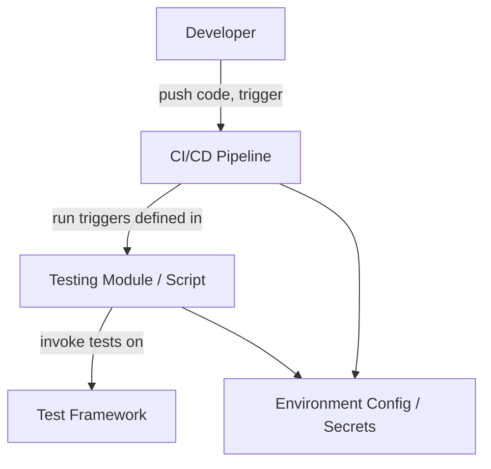

## 2026-03-08

Repository: santhoshvembaiyan-hash/mf-poc
Branch: refs/heads/main

Commit Message:testing trigger

### Architecture Update

1. **Component or Module Changed**  
The only change in the commit is to a file named `Testing`. Given the name, it likely corresponds to a testing module or component in the codebase.

2. **Architectural Impact**  
- The commit message "testing trigger" suggests that this change is related to setting up or modifying automated testing triggers or test scripts.  
- Since no code files or core modules appear to be modified, the architectural impact is minimal to none on the system's core architecture or runtime behavior.  
- This change likely affects the development pipeline or quality assurance (QA) processes rather than the production codebase.  
- It may enable or improve CI/CD testing automation, contributing positively to software quality, faster feedback loops, and better release management.

3. **Possible Dependencies**  
- The changes might depend on CI/CD tools or services such as GitHub Actions, Jenkins, Travis CI, or others.  
- Potential dependency on testing frameworks or test runners that this trigger interacts with (e.g., Jest, Mocha, JUnit, etc., although the exact tools are unknown).  
- If the `Testing` file is a script or configuration, it might rely on environment variables or service credentials configured in the pipeline.

4. **Suggested Documentation Update**  
- Update the developer or contributor guide to describe the new or updated testing trigger: when tests run, under what conditions, and how to troubleshoot.  
- Document any new scripts, setup steps, or dependencies introduced for testing.  
- Include any relevant environment setups or configuration required for the trigger to function properly.  
- If applicable, update the CI/CD pipeline documentation to reflect the changes in triggering or executing tests.

---

**Summary:**  
This commit focuses on testing infrastructure rather than core system modules. Its architectural impact is confined to improving development workflow and quality assurance processes. Documentation should be updated to ensure maintainers understand and can operate the new or modified testing triggers effectively.

### Architecture Diagram

